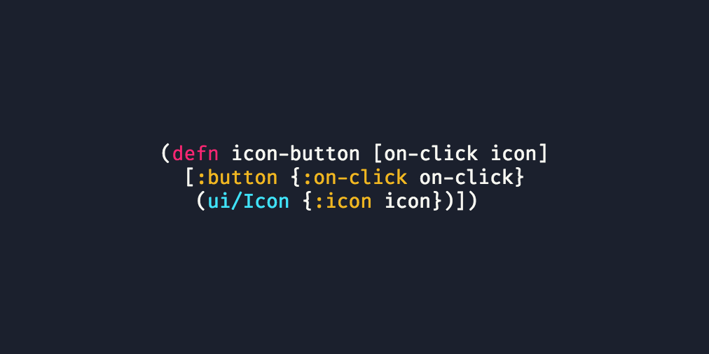

# code-cool

Generates screenshot of code snippets

[functionalcave.github.io/code-cool](https://functionalcave.github.io/code-cool/)



## License

MIT

## CLI Commands

``` bash
# install dependencies
npm install

# serve with hot reload at localhost:8080
npm run dev

# build for production with minification
npm run build

# test the production build locally
npm run serve
```

For detailed explanation on how things work, checkout the [CLI Readme](https://github.com/developit/preact-cli/blob/master/README.md).